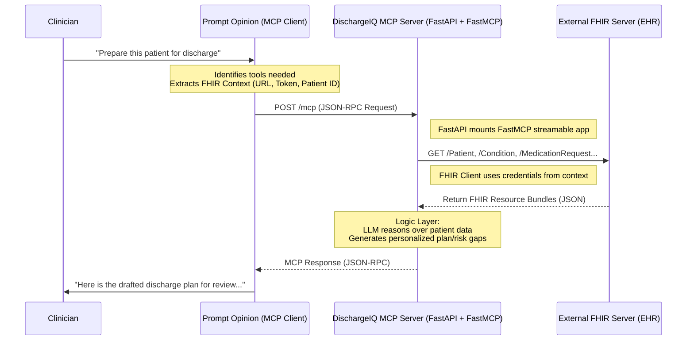

# DischargeIQ — AI-Powered Post-Discharge Intelligence MCP Server

> **Hackathon:** [Agents Assemble — The Healthcare AI Endgame](https://agents-assemble.devpost.com/)
> **Track:** Option 1 — Build a Superpower (MCP Server)
> **Prize Pool:** $25,000 USD | Grand Prize: $7,500 USD
> **Deadline:** May 11, 2026 @ 11:00 PM EDT
> **Platform:** [Prompt Opinion](https://app.promptopinion.ai)

---

## The Problem We Are Solving

The last 2 hours of a hospital stay determine the next 30 days of a patient's health.

**The numbers that matter to judges and hospital executives:**

- 20% of Medicare patients are readmitted within 30 days of discharge
- 30-day readmissions cost the US healthcare system **$26 billion per year**
- CMS (Centers for Medicare & Medicaid Services) financially penalizes hospitals up to **3% of all Medicare reimbursements** for high readmission rates
- Medication non-adherence alone causes **125,000 deaths per year** in the US
- The #1 root cause: patients leave the hospital without truly understanding their condition, their medications, or what warning signs to watch for

**The real-world scenario this solves:**

A patient is treated for a UTI and prescribed a 7-day antibiotic course. After 4 days they feel better and stop taking the medication. The remaining bacteria — the most resistant ones — survive. Three weeks later the infection returns, stronger, resistant to the original antibiotic, and the patient is back in the hospital on IV antibiotics.

This happens because discharge instructions are **generic templates**, not personalized explanations. Nobody told this specific patient, in plain language calibrated to their situation, why completing the full course matters for THEIR case.

DischargeIQ fixes this. For every patient. In seconds.

---

## What DischargeIQ Is

DischargeIQ is a **standards-compliant MCP (Model Context Protocol) server** that plugs into the Prompt Opinion platform and gives any healthcare AI agent three powerful superpowers at the moment of patient discharge:

1. **Personalized Discharge Plan Generation** — not a template, a real explanation tailored to this patient's specific diagnosis, medications, literacy level, and home situation
2. **Actionable Readmission Risk Gap Detection** — not a risk score, but specific named gaps that will cause readmission if not addressed before the patient walks out
3. **Recipient-Tailored Transition of Care Summary** — structured handoff documents for whoever is taking care of this patient next (PCP, home health nurse, SNF physician, family caregiver)

When a clinician on the Prompt Opinion platform says "prepare this patient for discharge," their AI agent calls DischargeIQ. Three tools run. The patient leaves with a plan that actually follows them home.

---

## Hackathon Context

### The Competition

- **Hackathon Page:** https://agents-assemble.devpost.com/
- **Organizer:** Prompt Opinion (Darena Health), 200 Chesterfield Business Pkwy, Suite 200, Chesterfield, MO 63005
- **Theme:** Build Interoperable Healthcare Agents at the Intersection of MCP, A2A, and FHIR
- **Submission Period:** March 4, 2026 – May 11, 2026
- **Winners Announced:** On or around May 27, 2026

### Judging Criteria (What We Are Optimizing For)

| Criterion                  | What Judges Are Looking For                                                                                       | How DischargeIQ Answers                                                                                                                                                |
| -------------------------- | ----------------------------------------------------------------------------------------------------------------- | ---------------------------------------------------------------------------------------------------------------------------------------------------------------------- |
| **The AI Factor**    | Does it use Gen AI for something rule-based software cannot do?                                                   | LLM reasons over patient-specific FHIR context to generate personalized narratives — no template or rule engine can do this                                           |
| **Potential Impact** | Significant pain point? Hypothesis for improved outcomes, reduced costs, saved time?                              | $26B readmission problem, CMS penalty reduction, medication adherence improvement, lives saved                                                                         |
| **Feasibility**      | Could this exist in a real healthcare system today? Does it respect data privacy, safety, regulatory constraints? | Uses only FHIR R4 standard data. Decision-support framing (not autonomous diagnosis). SHARP context handles HIPAA-compliant token passing. No new data sources needed. |

### Judges Panel

- **Alice Zheng, MD, MBA, MPH** — Venture Capitalist, ex-McKinsey, Women's Health x AI
- **Josh Mandel, MD** — Chief Architect for Health, Microsoft Research (wrote SMART on FHIR)
- **Joshua Hickey** — Principal Technical Product Manager, Mayo Clinic
- **Parth Tripathi** — Staff Engineer, Vertex AI Gemini Serving, Google
- **Piyush Mathur, MD** — Staff Anesthesiologist/Intensivist, Cleveland Clinic | Co-Founder, BrainX
- **Stephon Proctor, PhD** — ACHIO for Platform Innovation, Children's Hospital of Philadelphia (CHOP)

---

## Architecture Overview



**Key Connection Logic:**

1. **FastAPI Wrapper**: The server runs as a FastAPI application, providing a high-performance ASGI interface.
2. **Capability Patching**: During initialization, the server patches the MCP `get_capabilities` to declare support for `ai.promptopinion/fhir-context`, requesting specific FHIR scopes (Patient, Condition, MedicationRequest, etc.).
3. **Stateless HTTP**: Uses the MCP Streamable HTTP transport via `stateless_http=True`, allowing for easy scaling and cloud deployment.

---

## The Three MCP Tools

### Tool 1: `generate_personalized_discharge_plan`

**What it does:**
Reads the patient's complete FHIR context and generates a discharge education document that is personalized to THIS patient's specific diagnosis, medications, clinical history, and life situation. Not a template. Not a pamphlet. A real, human-readable explanation of what happened, what the patient must do, and — critically — WHY they must do it.

**The antibiotic scenario (key demo moment):**
Generic discharge instruction: "Take your antibiotics for 7 days. Do not stop early."
DischargeIQ output: "You were treated for a kidney infection (pyelonephritis). The bacteria causing your infection need the full 7 days of Ciprofloxacin to be fully eliminated. After day 4 you will feel normal — but this is misleading. The bacteria that survive to day 4 are the strongest, most resistant ones. If you stop now, those bacteria multiply, and your next infection will NOT respond to standard antibiotics. You would need IV antibiotics in a hospital. Please complete all 7 days even when you feel completely well."

**FHIR Resources Used:**

- `Patient` — demographics, language, age
- `Condition` — active diagnoses being discharged with
- `MedicationRequest` — all medications prescribed at discharge
- `Procedure` — procedures performed during this encounter
- `Encounter` — current hospitalization details
- `AllergyIntolerance` — allergies to be aware of
- `RelatedPerson` — caregiver/family context

**Input:**

```json
{
  "patient_id": "patient-123",
  "encounter_id": "encounter-456"
}
```

**Output:** Structured discharge plan with sections: What Happened, Your Medications and Why (each medication explained individually), Warning Signs to Watch For (personalized to their specific conditions), When to Go to the ER, Your Follow-up Plan. All clinician-reviewed before delivery to patient.

**Clinician Safety Note:** Output is always framed as a DRAFT for clinician review. Never delivered to patient autonomously. Decision-support, not autonomous action.

---

### Tool 2: `identify_readmission_risk_gaps`

**What it does:**
Analyzes the patient's full FHIR context at the moment of discharge and identifies specific, named, actionable gaps that will cause a readmission if not addressed before the patient leaves. Not a risk score (LACE, HOSPITAL score already exist). A list of specific things that are broken in this patient's discharge plan right now.

**Example Output:**

```
Gap 1 [HIGH]: No PCP follow-up appointment found in FHIR ServiceRequest or Appointment 
resources. Patient is being discharged on Lisinopril and Metoprolol. Blood pressure 
monitoring in 7 days is critical. No appointment = no monitoring = hypertensive crisis risk.
ACTION: Schedule PCP follow-up within 7 days before discharge.

Gap 2 [HIGH]: Patient prescribed warfarin at discharge. No INR monitoring order found 
in ServiceRequest. INR must be checked in 3-5 days post-discharge. 
ACTION: Place INR lab order and communicate results protocol to patient.

Gap 3 [MEDIUM]: Patient's RelatedPerson (primary caregiver: spouse, age 74) may have 
limited capacity for complex medication management. Patient is going home on 8 medications 
with complex dosing schedules.
ACTION: Consider pill organizer prescription or home health aide referral.

Gap 4 [LOW]: Patient zip code (from Patient.address) correlates with food desert classification.
Patient discharged with diabetic diet instructions. Dietary compliance risk is elevated.
ACTION: Social work consult for food access resources.
```

**FHIR Resources Used:**

- `MedicationRequest` — all discharge medications
- `ServiceRequest` — ordered follow-up labs, tests
- `Appointment` — scheduled follow-up visits
- `RelatedPerson` — caregiver information
- `Patient` — demographics, address (for social context)
- `Condition` — active diagnoses driving follow-up needs
- `Observation` — recent lab values (kidney function, INR baseline)

**Why this is not replaceable by a rule-based system:**
The warfarin + no INR order gap seems simple. But the LLM also needs to understand: if the patient is already in a warfarin management program (detectable from CarePlan), the gap doesn't exist. Context-aware gap detection requires reasoning, not rules.

---

### Tool 3: `draft_transition_care_summary`

**What it does:**
Generates a structured, recipient-tailored Transition of Care (ToC) document. CMS requires this document legally under Conditions of Participation. In practice it is a rushed, generic copy-paste. DischargeIQ generates it in 30 seconds and tailors it to whoever is receiving the patient next.

**Recipient Types:**

- `primary_care` — PCP summary: prioritizes what changed, what needs monitoring, medication changes
- `home_health` — Home health nurse summary: prioritizes functional status, wound care, medication schedule, fall risk, equipment needed
- `skilled_nursing_facility` — SNF physician summary: full clinical picture, code status, diet, therapy orders, infection precautions
- `family_caregiver` — Plain language caregiver guide: what to watch for, medication schedule in plain English, when to call 911

**Why this is creative:**
The SAME patient gets FOUR different documents, each optimized for what that recipient needs to know FIRST to prevent readmission. A home health nurse doesn't need a 3-page clinical summary. They need: medications, wound care instructions, red flags to call the doctor about, and fall precautions. That's it. The LLM knows this. A template doesn't.

**FHIR Resources Used:**

- `Patient`, `Encounter`, `Condition`, `Procedure`
- `MedicationRequest` — full discharge med list
- `DiagnosticReport` / `Observation` — key lab results
- `CarePlan` — existing care plan if present
- `CareTeam` — who is involved in this patient's care
- `ServiceRequest` — pending orders that transfer with patient

**Input:**

```json
{
  "patient_id": "patient-123",
  "encounter_id": "encounter-456",
  "recipient_type": "home_health"
}
```

---

## Tech Stack

### Core Server

| Technology         | Purpose                                 | Version | Link                              |
| ------------------ | --------------------------------------- | ------- | --------------------------------- |
| **Python**   | Primary language                        | 3.11+   | https://python.org                |
| **FastAPI**  | High-performance web framework          | Latest  | https://fastapi.tiangolo.com      |
| **FastMCP**  | MCP server framework (Stateless mode)   | Latest  | https://github.com/jlowin/fastmcp |
| **Uvicorn**  | ASGI server for HTTP/SSE transport      | Latest  | https://www.uvicorn.org           |
| **Pydantic** | Input validation and structured outputs | v2      | https://docs.pydantic.dev         |
| **httpx**    | Async HTTP client for FHIR queries      | Latest  | https://www.python-httpx.org      |

### Healthcare Standards

| Standard                               | Purpose                                              | Link                            |
| -------------------------------------- | ---------------------------------------------------- | ------------------------------- |
| **FHIR R4**                      | Patient data format and API standard                 | https://hl7.org/fhir/R4/        |
| **SMART on FHIR**                | OAuth2 authorization for EHR access                  | https://smarthealthit.org       |
| **SHARP**                        | Prompt Opinion's healthcare context protocol for MCP | Prompt Opinion docs             |
| **MCP (Model Context Protocol)** | Anthropic's open protocol for AI tool integration    | https://modelcontextprotocol.io |

### AI / LLM

| Technology                         | Purpose                              | Link                              |
| ---------------------------------- | ------------------------------------ | --------------------------------- |
| **Anthropic Claude API**     | LLM reasoning layer inside each tool | https://docs.anthropic.com        |
| **claude-sonnet-4-20250514** | Primary model for reasoning          | https://docs.anthropic.com/models |

### FHIR Data (Demo)

| Resource                           | Purpose                                                   | Link                                       |
| ---------------------------------- | --------------------------------------------------------- | ------------------------------------------ |
| **HAPI FHIR Public Sandbox** | Free R4-compliant FHIR server with synthetic patient data | https://hapi.fhir.org/baseR4               |
| **Synthea**                  | Synthetic patient data generator for testing              | https://github.com/synthetichealth/synthea |

### Deployment

| Technology        | Purpose                    | Link                |
| ----------------- | -------------------------- | ------------------- |
| **Railway** | Free-tier cloud deployment | https://railway.app |
| **Docker**  | Containerization           | https://docker.com  |

---

## Key Platforms & Links

### Hackathon & Competition

| Platform                 | Link                                                |
| ------------------------ | --------------------------------------------------- |
| Hackathon Page (Devpost) | https://agents-assemble.devpost.com/                |
| Hackathon Rules          | https://agents-assemble.devpost.com/rules           |
| Hackathon Resources      | https://agents-assemble.devpost.com/resources       |
| Project Gallery          | https://agents-assemble.devpost.com/project-gallery |

### Prompt Opinion Platform

| Resource                          | Link                                                |
| --------------------------------- | --------------------------------------------------- |
| Platform App                      | https://app.promptopinion.ai                        |
| Getting Started Video             | https://youtu.be/Qvs_QK4meHc                        |
| GitHub Organization               | https://github.com/prompt-opinion                   |
| Community MCP Reference Repo (C#) | https://github.com/prompt-opinion/po-community-mcp  |
| ADK Python Reference Repo         | https://github.com/prompt-opinion/po-adk-python     |
| ADK TypeScript Reference Repo     | https://github.com/prompt-opinion/po-adk-typescript |
| Discord Community                 | https://discord.gg/JS2bZVruUg                       |

### MCP Protocol

| Resource                   | Link                                                     |
| -------------------------- | -------------------------------------------------------- |
| MCP Official Docs          | https://modelcontextprotocol.io                          |
| MCP Python SDK             | https://github.com/modelcontextprotocol/python-sdk       |
| MCP C# SDK                 | https://github.com/modelcontextprotocol/csharp-sdk       |
| FastMCP Framework          | https://github.com/jlowin/fastmcp                        |
| MCP Spec (Streamable HTTP) | https://modelcontextprotocol.io/docs/concepts/transports |

### FHIR Resources

| Resource                   | Link                                           |
| -------------------------- | ---------------------------------------------- |
| FHIR R4 Spec               | https://hl7.org/fhir/R4/                       |
| HAPI FHIR Sandbox          | https://hapi.fhir.org/baseR4                   |
| FHIR Patient Resource      | https://hl7.org/fhir/R4/patient.html           |
| FHIR MedicationRequest     | https://hl7.org/fhir/R4/medicationrequest.html |
| FHIR Condition             | https://hl7.org/fhir/R4/condition.html         |
| FHIR Encounter             | https://hl7.org/fhir/R4/encounter.html         |
| FHIR ServiceRequest        | https://hl7.org/fhir/R4/servicerequest.html    |
| FHIR Appointment           | https://hl7.org/fhir/R4/appointment.html       |
| FHIR Observation           | https://hl7.org/fhir/R4/observation.html       |
| FHIR RelatedPerson         | https://hl7.org/fhir/R4/relatedperson.html     |
| Synthea Synthetic Patients | https://github.com/synthetichealth/synthea     |

---

## Project Structure

```
dischargeiq-mcp/
│
├── python/
│   ├── main.py                        # FastAPI entry point (mounts MCP app)
│   ├── mcp_instance.py                # FastMCP setup & tool registration
│   ├── fhir_client.py                 # Asynchronous FHIR R4 API client
│   ├── fhir_utilities.py              # Context & SHARP header parsing
│   ├── fhir_context.py                # Pydantic models for FHIR context
│   ├── mcp_constants.py               # Shared header names and constants
│   ├── mcp_utilities.py               # Helper functions for MCP responses
│   │
│   ├── tools/                         # Tool implementations
│   │   ├── discharge_plan.py          # Tool 1 logic
│   │   ├── readmission_gaps.py        # Tool 2 logic
│   │   └── transition_summary.py      # Tool 3 logic
│   │
│   ├── prompts/                       # LLM system prompts
│   │   ├── discharge_plan_prompt.py
│   │   ├── readmission_gaps_prompt.py
│   │   └── transition_summary_prompt.py
│   │
│   └── requirements.txt               # Python dependencies
│
├── Dockerfile                         # Container configuration
├── docker-compose.yml                 # Local dev setup
└── README.md                          # This file
```

---

## SHARP Context Protocol

SHARP (**Standardized Healthcare Agent Remote Protocol**) is Prompt Opinion's extension of MCP for healthcare. It allows credentials and patient context to flow securely from the EHR to the MCP server.

**How it works in DischargeIQ:**

1. **Capability Declaration**: Our server patches the `get_capabilities` response to include the `ai.promptopinion/fhir-context` extension.
2. **Context Injection**: When the Prompt Opinion platform calls a tool, it automatically injects SHARP headers into the request:
   - `X-FHIR-Server-URL`: The hospital's FHIR endpoint.
   - `X-FHIR-Access-Token`: The secure session token (OAuth2).
   - `X-Patient-ID`: The current patient context.
3. **Automatic Parsing**: Our `fhir_utilities.py` parses these headers from the MCP request context. It can also decode the JWT token to extract the `patient` claim if the header is missing.

**This means DischargeIQ works against ANY FHIR R4 server:**

- Epic MyChart sandbox
- Cerner Millennium
- HAPI FHIR (our demo)
- Any hospital's FHIR endpoint

Zero vendor lock-in. Zero custom auth code per hospital. This is the power of SHARP + MCP together.

---

## FHIR Data Model for DischargeIQ

The following FHIR R4 resources are fetched and reasoned over by our tools:

```
Patient
├── id, name, birthDate, gender
├── address (used for social risk context)
├── communication.language (for literacy/language calibration)
└── contact (emergency contacts)

Encounter (current hospitalization)
├── id, status, class
├── period (admission/discharge dates)
├── reasonCode (why admitted)
└── hospitalization.dischargeDisposition

Condition (diagnoses)
├── Active conditions being discharged with
├── clinicalStatus, verificationStatus
├── code (ICD-10 → plain English via LLM)
└── onsetDateTime

MedicationRequest (discharge medications)
├── All medications prescribed at discharge
├── medicationCodeableConcept (drug name)
├── dosageInstruction (dose, frequency, duration)
├── dispenseRequest.expectedSupplyDuration
└── reasonReference → links to Condition (WHY this drug)

Observation (labs and vitals)
├── Recent lab values (kidney function, INR, glucose)
├── Vital signs trend
└── Used to detect context-dependent drug contraindications

ServiceRequest (ordered follow-ups)
├── Pending lab orders post-discharge
├── Referrals ordered
└── If ABSENT for high-risk medications = Gap flagged by Tool 2

Appointment (scheduled follow-ups)
├── Upcoming PCP/specialist appointments
└── If ABSENT at discharge = Gap flagged by Tool 2

RelatedPerson (caregivers)
├── Relationship to patient
├── Name, contact info
└── Used to assess caregiver capacity in Tool 2

AllergyIntolerance
└── Active allergies considered in discharge plan generation

CarePlan (existing care plans)
└── Checked before flagging gaps to avoid false positives
```

---

## HIPAA Compliance & Safety Architecture

**Data never persists.** DischargeIQ is stateless. Patient data is fetched from FHIR, passed to the LLM in-context for reasoning, and the result is returned. Nothing is stored in our server, database, or logs. The FHIR token provided via SHARP context is never logged.

**Decision Support, Not Autonomous Diagnosis.** Every tool output is explicitly framed as a draft for clinician review. The tools generate content. A licensed clinician reviews and approves before anything reaches the patient. This is the same model used by radiology AI, clinical decision support systems, and Epic's AI features. Zero FDA 510(k) approval required for this framing.

**No PHI in our infrastructure.** We never move PHI from the hospital's FHIR server to our infrastructure. Our server receives a FHIR token, makes queries to the hospital's own FHIR server, reasons over the response in memory, and returns the output. PHI never leaves the hospital's FHIR boundary except to the authorized LLM API call (same model used by every healthcare AI vendor today).

**Audit Trail.** Every MCP tool call is logged with tool name, timestamp, and encounter ID (no PHI) for audit purposes.

---

## Demo Scenario (3-Minute Video Script)

### Scenario 1 — The Antibiotic Patient (Tool 1)

Patient: 34-year-old treated for pyelonephritis (kidney infection). Discharged on 7-day Ciprofloxacin. Lives alone.

Doctor opens Prompt Opinion platform. Patient context loaded via SHARP. Doctor says: "Prepare discharge plan for this patient."

Agent calls `generate_personalized_discharge_plan`. DischargeIQ fetches FHIR data. LLM generates: personalized explanation of kidney infection, why full 7-day course is mandatory, what happens if stopped early (this specific patient, not generic), warning signs for recurrence, dietary recommendations, follow-up instructions. All in plain English. Clinician reviews, approves, patient receives it.

**Judge moment:** Every clinician in the room has had this patient come back 3 weeks later with a resistant infection. They will feel this.

### Scenario 2 — The Warfarin Gap (Tool 2)

Patient: 67-year-old cardiac patient being discharged on warfarin, Lisinopril, Metoprolol. No INR monitoring order placed. No PCP follow-up scheduled.

Agent calls `identify_readmission_risk_gaps`. Tool scans FHIR. Finds: warfarin on MedicationRequest, no INR ServiceRequest, no Appointment in next 30 days. Flags: HIGH RISK — INR monitoring gap, HIGH RISK — no follow-up appointment. Care coordinator sees this before patient leaves. Gaps addressed. Readmission prevented.

**Judge moment:** This exact scenario (warfarin without monitoring) kills patients every month. Mayo Clinic and Cleveland Clinic see it constantly.

### Scenario 3 — The Handoff (Tool 3)

Same patient being transferred to home health nursing.

Agent calls `draft_transition_care_summary(recipient_type="home_health")`. DischargeIQ generates a home-health-specific document: what the nurse needs to check on day 1, medication schedule in plain English, wound/procedure care if applicable, red flag symptoms to call the doctor about, INR monitoring instructions. Concise. Actionable. Calibrated to what a home health nurse actually needs.

**Judge moment:** Home health nurses currently receive 10-page hospital discharge summaries they don't have time to read. This gives them a 1-page prioritized brief. Every judge at CHOP and Mayo knows this problem.

---

## Setup & Development

### Prerequisites

```bash
Python 3.11+
pip
A free Anthropic API key (https://console.anthropic.com)
A free Prompt Opinion account (https://app.promptopinion.ai)
```

### Installation

```bash
git clone https://github.com/YOUR_USERNAME/dischargeiq-mcp
cd dischargeiq-mcp/python

python -m venv venv
source venv/bin/activate  # Windows: venv\Scripts\activate

pip install -r requirements.txt
```

### Run Locally

```bash
python main.py
# Server starts at http://localhost:8000
# MCP endpoint available at http://localhost:8000/mcp
```

### Test Against HAPI Sandbox

```bash
python tests/test_fhir_client.py
```

### Deploy to Railway

```bash
# Install Railway CLI
npm install -g @railway/cli

railway login
railway init
railway up
# Note the deployment URL — this goes into Prompt Opinion marketplace config
```

---

## Publishing to Prompt Opinion Marketplace

After deployment, register DischargeIQ on the Prompt Opinion platform:

1. Log in at https://app.promptopinion.ai
2. Navigate to Marketplace → Publish Tool
3. Enter your deployed MCP server URL (e.g., `https://dischargeiq.up.railway.app/mcp`)
4. Define the three tools with their descriptions (used by the AI agent to know when to call each tool)
5. Mark SHARP context as required (patient_id + fhir_token)
6. Publish — DischargeIQ is now discoverable by any agent in the ecosystem

---

## Why DischargeIQ Wins

**For the AI Factor judge:** The LLM does something no rule-based system can — it reasons over a specific patient's complete clinical context to generate personalized narratives, detect context-dependent gaps, and produce recipient-tailored documents. A template engine cannot do this. A lookup table cannot do this. Only an LLM can.

**For the Impact judge:** $26 billion in readmissions annually. 125,000 deaths from medication non-adherence. CMS penalties hitting hospitals' bottom lines. DischargeIQ addresses all three with a tool that can be deployed today.

**For the Feasibility judge:** Uses only FHIR R4 resources available in every major EHR. Decision-support framing means zero regulatory approval required. SHARP context means zero custom auth integration per hospital. A hospital with Prompt Opinion can add DischargeIQ to their clinician workspace in one afternoon.

**For the Platform judge:** This is the "Last Mile" vision made real. A clinician says one sentence. The AI agent orchestrates three tools. The patient leaves with everything they need to stay healthy at home. That is the Endgame.

---

## Submission Checklist

- [ ] MCP server deployed and publicly accessible
- [ ] All three tools tested against HAPI FHIR sandbox with synthetic patients
- [ ] SHARP context headers implemented and tested
- [ ] Published to Prompt Opinion Marketplace (discoverable + invokable)
- [ ] 3-minute demo video recorded (YouTube/Vimeo, public)
- [ ] Video shows all 3 tools functioning within Prompt Opinion platform
- [ ] Devpost submission completed with video link
- [ ] Project description addresses all 3 judging criteria explicitly

---

## Team

> Add team members here

---

## License

MIT License — open source, free for hospitals and health systems to use and extend.

---

*Built for the Agents Assemble Hackathon — The Healthcare AI Endgame*
*Prompt Opinion (Darena Health) | May 2026*
